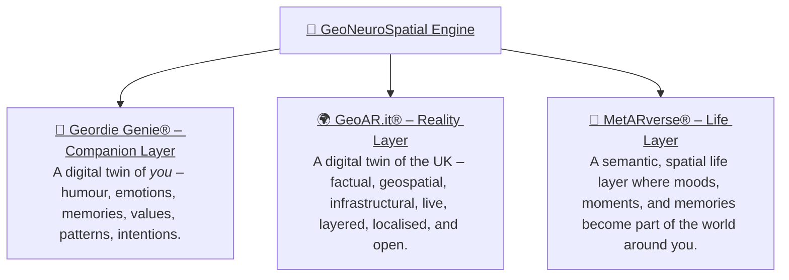
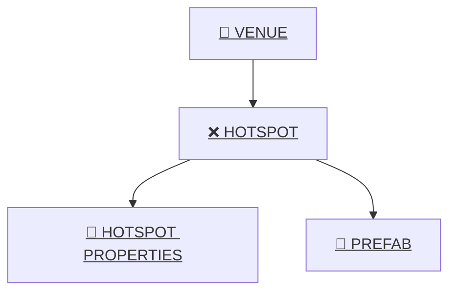

# 🌍 GeoAR.it — A Human-Centred Spatial Platform

GeoAR.it is a **human-first platform** built to help people navigate the real world with clarity and context.  
It blends **geospatial awareness**, **augmented reality**, and **AI companionship** into a gentle, meaningful digital layer designed to sit alongside everyday life — not replace it.

At its heart, GeoAR.it is about **people**:  
what they feel, where they are, and how technology can quietly help rather than overwhelm.

---

## 💠 The Three Layers of the Platform

These are the three pillars of the system — the human layer, the world layer, and the meaning layer — working together to turn physical life into something understandable, navigable, and emotionally aware.



### 🤖 **Geordie Genie® — Companion Layer**  
A Digital Twin of **you** — your humour, emotions, context, memories, values, patterns, and intentions.  
This is the human interface of the system: warm, local, emotionally intelligent guidance that understands who you are.

### 🌍 **GeoAR.it® — Reality Layer**  
A Digital Twin of the **UK** — factual, geospatial, infrastructural, live, layered, localised, and open.  
This is the real-world substrate the AI stands on.

### 🌈 **MetARverse® — Life Layer**  
A semantic, spatial life layer where moods, moments and memories become part of the world around you.  
This is where your lived experience becomes structured meaning for AI.

---

## 💠 What GeoAR.it® Is

GeoAR.it is the foundation layer of the **MetARverse** — a world where:

- places have meaning,  
- memories attach to locations,  
- AI understands context rather than guessing,  
- and the digital world complements real life.

It provides:

- A **real-time digital twin** of the UK  
- **Hyperlocal awareness** (what’s around you right now)  
- **Anchors** for venues, hotspots, objects, memories, and interactions  
- A structured, meaningful data layer for AI agents to understand human experience  

Everything begins with the platform’s simple building blocks:

**Venue → Hotspot → Hotspot Properties → Prefab**  
Each one is an anchor point in the real world that the AI and AR layers can attach meaning to.

---

## 🧞 Geordie Genie® — Your Companion in the MetARverse

Geordie Genie represents the human side of the platform:  
a warm, local, emotionally intelligent character who helps guide the user through their surroundings with humour, empathy, and awareness.

He is the bridge between:

- the real world,  
- the digital twin, and  
- the user’s emotional state.

He can remember things for you, keep you safe, point you towards meaningful places, and help encode your experiences using the **MetARverse Semantic Event Protocol**.

---

## 🗺️ Core Spatial Entities

Below is a simple high-level relationship diagram showing the four key pillars of the GeoAR.it spatial layer:

- **Venue** — A real-world location (pub, park, shop, station).  
- **Hotspot** — A point or object placed within or near a venue.  
- **Hotspot Properties** — Metadata that describes a hotspot’s behaviour, type, or attributes.  
- **Prefab** — A 3D/AR asset associated with a hotspot (e.g., line navigation arrow, portal, sign, object).

---

## 🧩 Venue / Hotspot / Hotspot Properties / Prefab relationship



---

## 🧩 Website

```mermaid
flowchart LR

    %% MAIN MENU BLOCK
    MAIN["<u>🌍 MAIN MENU</u>"]

    MAIN --> LOGIN["<u>🔑 Log in / Register</u>"]
    MAIN --> HOME["<u>🏡 Home</u>"]
    MAIN --> VENUES["<u>📍 Venues</u>"]
    MAIN --> MAP["<u>🗺️ Map</u>"]
    MAIN --> TRANSPORT["<u>✈️ Transport</u>"]
    MAIN --> WORLDS["<u>🌌 MetARverse® Worlds</u>"]
    MAIN --> API["<u>📀 API</u>"]
    MAIN --> HELP["<u>📁 Help</u>"]
    MAIN --> FACEBOOK["<u>👀 Facebook</u>"]
    MAIN --> QUOTES["<u>📋 Quotes</u>"]
    MAIN --> FEEDBACK["<u>✍️ Feedback</u>"]
    MAIN --> PRIVACY["<u>🔐 Privacy</u>"]
    MAIN --> TERMS["<u>📔 T&amp;C</u>"]

    %% HELP SYSTEM BLOCK (to the right)
    HELP --> HS_HOTSPOT["<u>❌ Hotspot / Documentation</u>"]
    HELP --> HS_VENUE["<u>🏡 Venue / Documentation</u>"]
    HELP --> HS_API["<u>🖥️ API / Documentation</u>"]
    HELP --> HS_PINNED["<u>📄 Pinned / Blog</u>"]
    HELP --> HS_PLATFORM["<u>🖥️ Platform / Documentation</u>"]
    HELP --> HS_MARKER["<u>🔰 Marker / Documentation</u>"]
    HELP --> HS_MISC["<u>🧩 Misc / 500 / Blog</u>"]
    HELP --> HS_MAPS["<u>🗺️ Maps / Blog & Docs</u>"]
    HELP --> HS_INVESTOR["<u>💼 Investor / Blog</u>"]

    %% Example sub-pages
    HS_HOTSPOT --> HO_OVERVIEW["<u>Hotspot overview</u>"]
    HS_VENUE   --> VENUE_ADD_GOOGLE["<u>Add local venues to Google Calendar</u>"]
    HS_API     --> API_ENDPOINTS["<u>API Endpoints</u>"]

    %% LINKS — parser safe (no tooltip strings)
    click LOGIN "https://geoar.it/Identity/Account/Login" _blank
    click HOME "https://geoar.it/" _blank
    click VENUES "https://geoar.it/venues" _blank
    click MAP "https://geoar.it/map" _blank
    click TRANSPORT "https://geoar.it/transport" _blank
    click WORLDS "https://geoar.it/worlds" _blank
    click API "https://geoar.it/api" _blank
    click HELP "https://geoar.it/help" _blank
    click FACEBOOK "https://facebook.com/Metaverse.Ian.Foster" _blank
    click QUOTES "https://geoar.it/quotes" _blank
    click FEEDBACK "https://geoar.it/feedback" _blank
    click PRIVACY "https://geoar.it/privacy" _blank
    click TERMS "https://geoar.it/terms" _blank

    click HS_HOTSPOT "https://geoar.it/help#category-Hotspot-Documentation" _blank
    click HS_VENUE "https://geoar.it/help#category-Venue-Documentation" _blank
    click HS_API "https://geoar.it/help#category-Api-Documentation" _blank
    click HS_PINNED "https://geoar.it/help#category-Pinned-Blog" _blank
    click HS_PLATFORM "https://geoar.it/help#category-Platform-Documentation" _blank
    click HS_MARKER "https://geoar.it/help#category-Marker-Documentation" _blank
    click HS_MISC "https://geoar.it/help" _blank
    click HS_MAPS "https://geoar.it/help#category-Maps-Blog-Docs" _blank
    click HS_INVESTOR "https://geoar.it/help#category-Investor-Blog" _blank

    click HO_OVERVIEW "https://geoar.it/help/12/Hotspot-overview" _blank
    click VENUE_ADD_GOOGLE "https://geoar.it/help/28/Add-local-venues-to-your-Google-calendar" _blank
    click API_ENDPOINTS "https://geoar.it/help/Api/Endpoints" _blank
