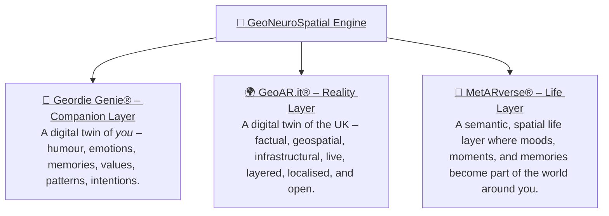
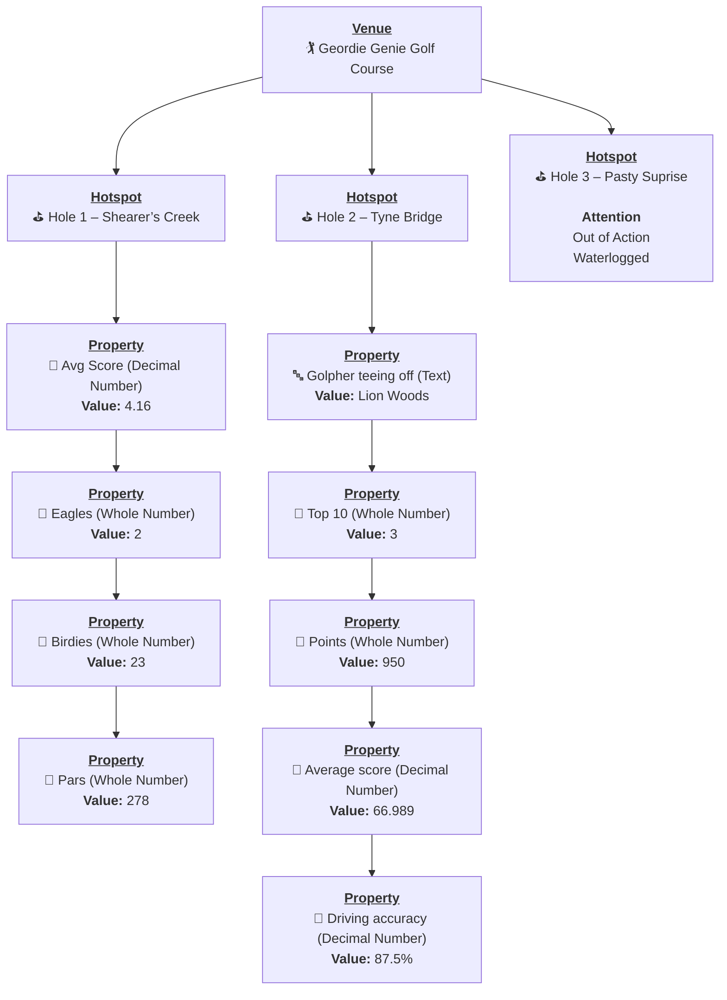
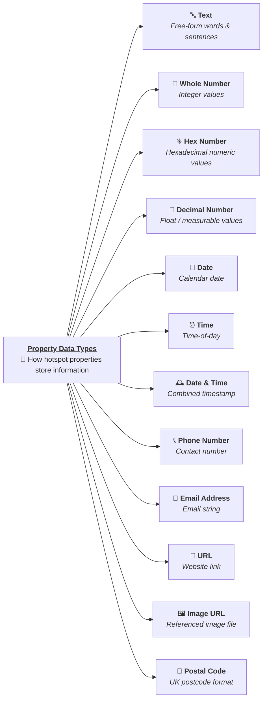
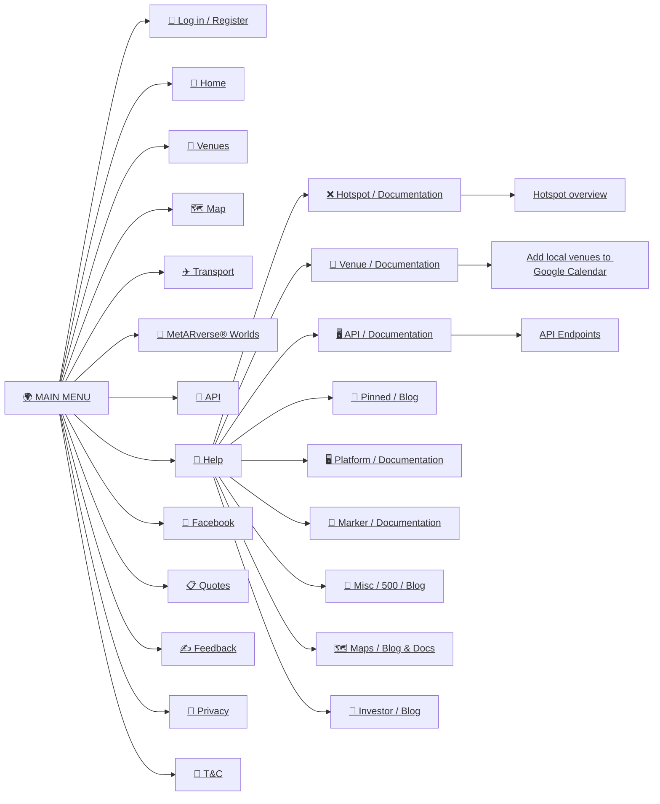
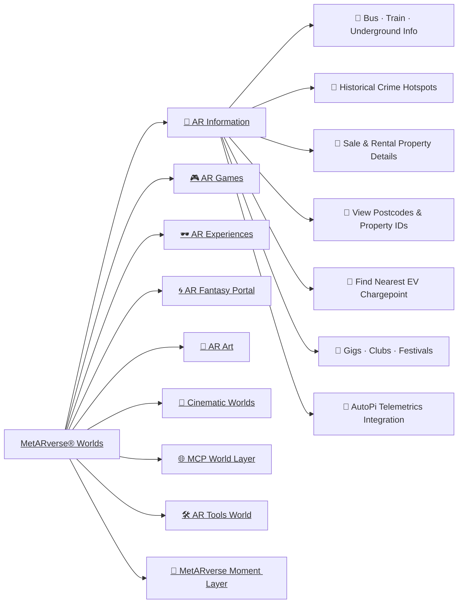

# 🧠👓🌍 **GeoNeuroSpatial Engine**

GeoAR.it is built on a simple belief: technology should help people move through the world with clarity, confidence, and emotional grounding.  It blends **geospatial awareness**, **augmented reality**, and **AI companionship** into a calm, meaningful digital layer — something that enhances everyday life without intruding on it.

At its core, the system is about **humans**: what they feel, where they stand, and how intelligence can support them quietly, intuitively, and with empathy.

All of this converges into the **GeoNeuroSpatial Engine** — the fusion of the human layer, the world layer, and the semantic meaning layer.  
Together they create a spatial intelligence that turns physical life into something understandable, navigable, predictive, and emotionally aware —  **running on-edge to protect the user’s privacy and keep their world truly their own.**

### 🤖 **Geordie Genie® — Companion Layer**  
A Digital Twin of **you** — your humour, emotions, context, memories, values, patterns, and intentions.  
This is the human interface of the system: warm, local, emotionally intelligent guidance that understands who you are.

### 🌍 **GeoAR.it® — Reality Layer**  
A Digital Twin of the **UK** — factual, geospatial, infrastructural, live, layered, localised, and open.  
This is the real-world substrate the AI stands on.

### 🌈 **MetARverse® — Life Layer**  
A semantic, spatial life layer where moods, moments and memories become part of the world around you.  
This is where your lived experience becomes structured meaning for AI.

---

## 💠 What GeoAR.it® Is

GeoAR.it is the foundation layer of the **MetARverse** — a world where:

- places have meaning,  
- memories attach to locations,  
- AI understands context rather than guessing,  
- and the digital world complements real life.

It provides:

- A **real-time digital twin** of the UK  
- **Hyperlocal awareness** (what’s around you right now)  
- **Anchors** for venues, hotspots, objects, memories, and interactions  
- A structured, meaningful data layer for AI agents to understand human experience  

Everything begins with the platform’s simple building blocks:

**Venue → Hotspot → Hotspot Properties → Prefab**  
Each one is an anchor point in the real world that the AI and AR layers can attach meaning to.

---

## 🧞 Geordie Genie® — Your Companion in the MetARverse

Geordie Genie represents the human side of the platform:  
a warm, local, emotionally intelligent character who helps guide the user through their surroundings with humour, empathy, and awareness.

He is the bridge between:

- the real world,  
- the digital twin, and  
- the user’s emotional state.

He can remember things for you, keep you safe, point you towards meaningful places, and help encode your experiences using the **MetARverse Semantic Event Protocol**.

---

## 🗺️ Core Spatial Entities

Below is a simple high-level relationship diagram showing the four key pillars of the GeoAR.it spatial layer:

- **Venue** — A real-world location (pub, park, shop, station).  
- **Hotspot** — A point or object placed within or near a venue.  
- **Hotspot Properties** — Metadata that describes a hotspot’s behaviour, type, or attributes.  
- **Prefab** — A 3D/AR asset associated with a hotspot (e.g., line navigation arrow, portal, sign, object).

---

## 🧩 Venue / Hotspot / Hotspot Properties / Prefab relationship

---
## 🧩 Hotspot Properties

---

## 🧩 Website Menu 

----

## 🧩 MetARverse® Worlds

