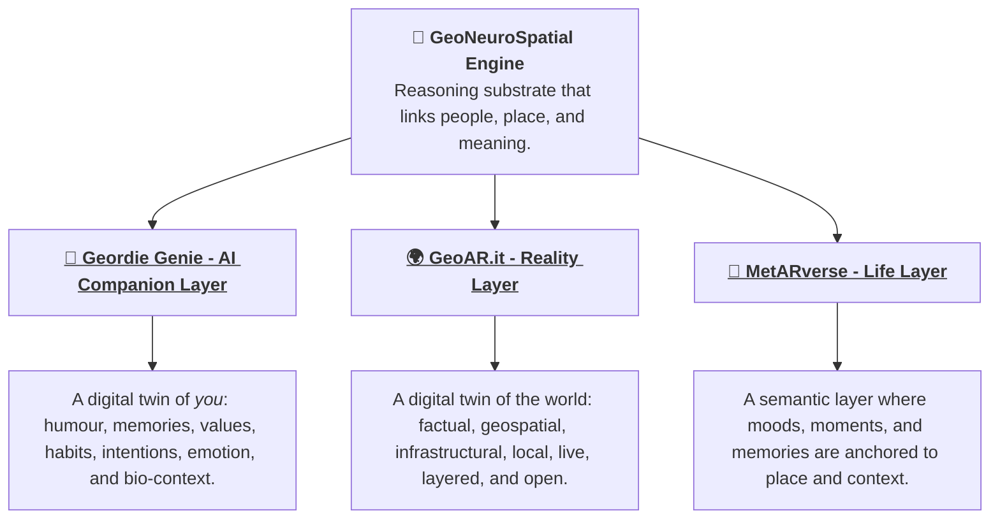
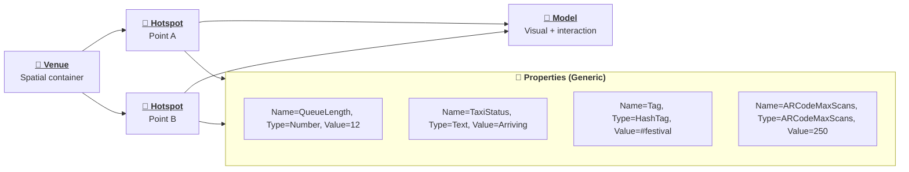
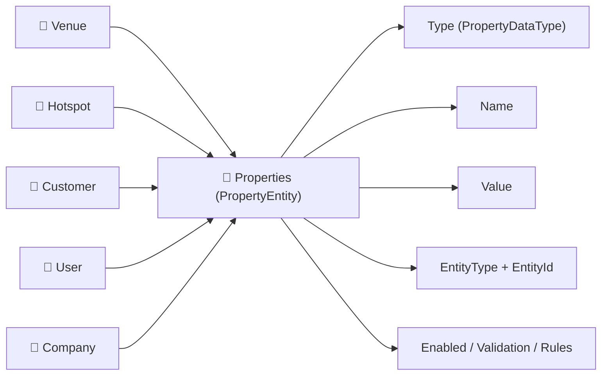
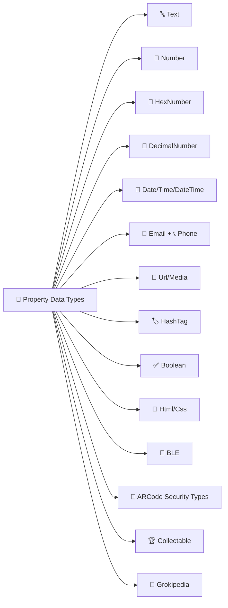
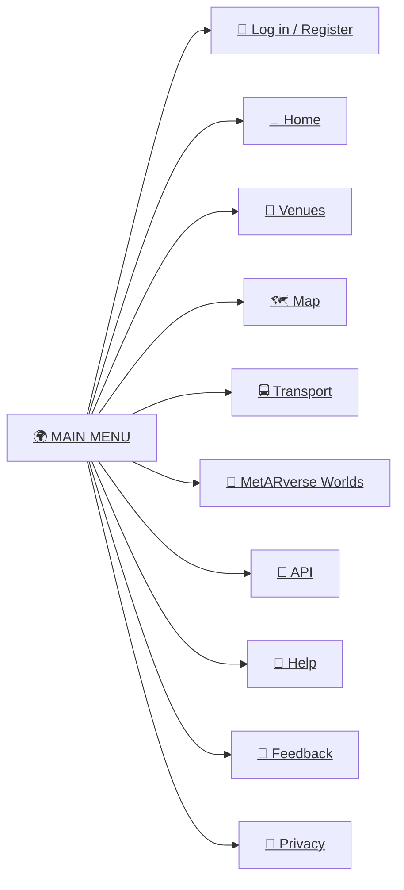
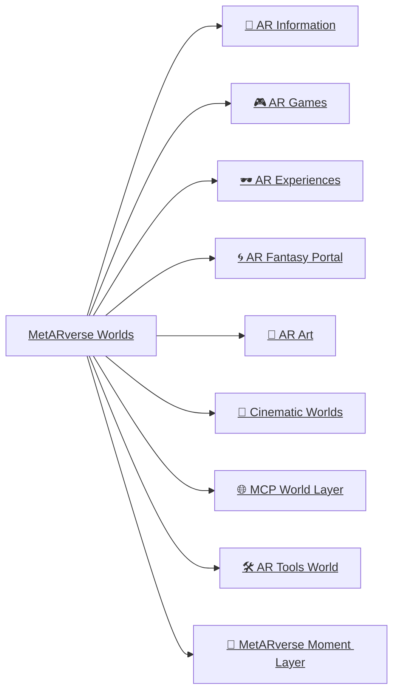

# 👓🌍🧠 **GeoNeuroSpatial Intelligence Engine (v3)**

(Public issues repository: https://github.com/GeoARit/Public)

GeoAR.it is built on a simple belief: technology should help people move through the world with clarity, confidence, and emotional grounding.

It blends:
- **geospatial awareness**,
- **augmented reality**,
- and **AI companionship**

into a calm, meaningful digital layer that enhances everyday life without getting in the way.

At its core, the system is about **humans**:
- what they feel,
- where they are,
- what they are trying to do,
- and how intelligence can support them quietly, contextually, and safely.

All of this converges into the **GeoNeuroSpatial Engine**:
- the human layer,
- the world layer,
- and the semantic meaning layer.

Together these create spatial intelligence that is understandable, navigable, predictive, and emotionally aware, with on-edge privacy principles at the centre.

---

## GeoNeuroSpatial Diagram

---

## 💠 What GeoAR.it Is

GeoAR.it is the foundation layer of the MetARverse, where:
- places carry meaning,
- memory can anchor to location,
- AI can reason from context,
- and digital overlays complement physical life.

It provides:
- a **real-time digital twin**,
- **hyperlocal awareness**,
- **anchors** for places and interactions,
- and a **structured semantic substrate** for AI and AR.

Everything starts with four disciplined building blocks:

**Venue  Hotspot  Properties  Model**

This is now the canonical core model.

---

## 🧞 Geordie Genie

Geordie Genie is the human-facing companion layer.

It is designed to:
- guide,
- reassure,
- explain,
- remember,
- and personalise support in local context.

Geordie Genie sits between:
- the user,
- the reality layer,
- and the semantic life layer,

so that interaction feels natural and grounded rather than abstract.

---

## 🗺 Core Spatial Entities (Revised)

### 🧩 MetARverse Core Entities

| Entity | Description |
|--------|-------------|
| **Venue** | A real-world container location: pub, station, campus, festival ground, park, retail site, civic space. |
| **Hotspot** | A meaningful point or zone in/near a venue: queue point, stage, tent, stand, route point, object anchor, service point. |
| **Properties (Generic)** | Unified typed key/value metadata attached to Venue, Hotspot, User/Customer, Company, and other supported entity types. |
| **Model** | A reusable AR/3D visual + interaction representation linked to hotspots. |

### Architecture note

The platform now uses a **generic Properties model** (`PropertyEntity`) as the primary semantic metadata path.

That means:
- fewer one-off schema fragments,
- one indexing/query pattern across entities,
- and a consistent contract for validation, rule evaluation, and AI interpretation.

Hashtags are represented as a **property type** (`PropertyDataType.HashTag`) rather than requiring dedicated per-entity hashtag join paths.

---

## 🏡 Venue / 📍 Hotspot / 🧩 Properties / 🧊 Model relationship

In the MetARverse, real-world locations move through a semantic chain:
- Venue defines the space,
- Hotspot defines meaningful points inside that space,
- Properties define live truth and semantics,
- Model defines spatial visual/interaction behaviour.

A venue can contain many hotspots.
Each hotspot can hold many property rows.
Properties can represent live operational data, human context, status, alerts, logistics, and narrative meaning.

This creates a direct pipeline:
- real-world state -> structured properties -> semantic meaning -> AR/AI experience.

---

## 🧩 Properties (Generic)

Hotspots are no longer limited to one data point.
Each hotspot can carry many properties, and that same property mechanism applies across other entity types too.

Examples:
- taxi rank: availability + ETA + capacity
- bus stand: destination + departure + delay status
- stage: lineup + start times + current performer
- medical point: triage status + queue + on-shift staff
- queue point: live count + trend + expected wait
- safety point: warning state + crowd pressure + advisory level

Properties can be updated by:
- owner systems,
- integrations,
- sensors,
- service operators,
- or platform agents.

This makes each mapped point a live semantic surface, not static text.

---

## 🧩 Entity -> Properties overview

---

## 🧩 Property examples table

| Hotspot | Property 1 | Property 2 | Property 3 |
|---|---|---|---|
| 🚕 Taxi Rank | 🚕 Taxi A - 6 seater - Available | 🚕 Taxi B - 4 seater - ETA 5m | 🚕 Taxi C - 8 seater - Busy |
| 🚌 Bus Stand | 🚌 Bus A - Newcastle - 13:45 | 🚌 Bus B - Durham - 14:10 | 🚌 Bus C - Delayed |
| 🏥 Medical Tent | 🧑‍⚕️ Medic 1 - Triage - Available | 🧑‍⚕️ Medic 2 - Treating | 🧑‍⚕️ Medic 3 - Returning 14:10 |
| 🎵 Festival Stage | 🎤 Performer 1 - 20:00 | 🎤 Performer 2 - 21:30 | 🎤 Performer 3 - 23:00 |
| 🌭 Food Van | 🌭 Hotdog - 14 left | 🍟 Fries - Low stock | 🥤 Drinks - Full stock |
| ⏱ Queue Point | 👥 Queue=12 | ⌛ Wait=8m | 📈 Trend=Rising |
| ⚠️ Safety Zone | 🌬 Wind=High | 👥 Crowd=Heavy | 🟡 Status=Monitor |

---

## 🧩 Property Data Types (full platform set)

| PropertyDataType | Description | Typical use |
|---|---|---|
| 🔤 Text | Free text | names, labels, status |
  | 🔢 Number | Whole number | counts, tallies, queue size |
  | 🔣 HexNumber | Hexadecimal value | identifiers, hardware/device signatures |
  | 🔣 DecimalNumber | Decimal value | scores, percentages, prices |
  | 📅 Date /  Time / 🕰 DateTime | Temporal values | schedules, ETA, event timing |
  | 📧 EmailAddress | Email string | contact and notifications |
  | 📞 PhoneNumber / 📱 MobilePhone | Phone/contact values | support and escalation routes |
  | 🔗 Url / 🖼 ImageUrl / 🎬 VideoUrl | Linked media/resource | docs, posters, streams |
  | 📮 PostalCode / 📱 MobilePhone | structured contact/location | routing and contact workflows |
  | 🏷 HashTag | hashtag semantic value | thematic tagging and discovery |
  |  Boolean | true/false flags | enabled states, operational toggles |
  | 🧾 Html / 🎨 Css | rich display + linked style | managed content rendering |
  | 📡 Ble | BLE identifier semantics | local device/beacon integrations |
  | 🔐 ARCodePassword / 🔢 ARCodeMaxScans / 📍 ARCodeGpsRadiusMeters | ARCode security controls | secure and bounded ARCode
  access |
  | 🏆 Collectable /  CollectablePoints | gamification controls | progression and reward systems |
  | 🧠 Grokipedia | Knowledge/semantic text field | long-form AI-readable context |

• | PropertyDataType | Description | Typical use |
  |---|---|---|
  | 🔤 Text | Free text | names, labels, status |
  | 🔢 Number | Whole number | counts, tallies, queue size |
  | 🔣 HexNumber | Hexadecimal value | identifiers, hardware/device signatures |
  | 🔣 DecimalNumber | Decimal value | scores, percentages, prices |
  | 📅 Date / 🕰 Time / 📆 DateTime | Temporal values | schedules, ETA, event timing |
  | 📧 EmailAddress | Email string | contact and notifications |
  | 📞 LandlinePhone / 📱 MobilePhone | Phone/contact values | support and escalation routes |
  | 🔗 Url / 🖼 ImageUrl / 🎬 VideoUrl / 🎵 AudioUrl / 📁 FileUrl | Linked media/resource | docs, posters, streams, downloads
  |
  | 📮 PostalCode / 🏠 PostcodeHouseNumber / 🏡 PostcodeHouseName / 📍 Address | Structured contact/location | routing,
  lookup, and contact workflows |
  | 🏷 HashTag | Hashtag semantic value | thematic tagging and discovery |
  | ✅ Boolean | True/false flags | enabled states, operational toggles |
  | 🧾 Html / 🎨 Css | Rich display + linked style | managed content rendering |
  | 📡 Ble | BLE identifier semantics | local device/beacon integrations |
  | 🔐 ARCodePassword / # ARCodePasswordHash / 🧂 ARCodePasswordSalt / 🔢 ARCodeMaxScans / 📍 ARCodeGpsRadiusMeters | ARCode
  security controls | secure and bounded ARCode access |
  | 🏆 Collectable / 🥇 CollectablePoints | Gamification controls | progression and reward systems |
  | 🧠 Grokipedia | Knowledge/semantic text field | long-form AI-readable context |
  | 📆 DateRange / 🕰 TimeRange / 📆 DateTimeRange | Temporal ranges | operating windows, validity periods |
  | 🎨 StartColourHex / 🎨 EndColourHex | Colour values | gradients and visual theming |
  | 🚗 CarMake / 🚘 CarModel / 🧩 ServiceType | Domain-specific metadata | transport/service categorisation |
  | 🧠 Ontology / 🧠 SemanticEventType / 🧠 SemanticEventStatus / 🧭 SemanticAnchorType / 🧭 SemanticAnchorId / 🧠
  ContextClusterId / 🧠 EngramId | Semantic graph fields | knowledge linking and semantic indexing |
  | 💷 UkTaxCode | UK tax reference | billing/compliance classification |
  | 🌐 WebsiteUrl / 🌐 MetARverseWebsiteUrl | Website links | public site and MetARverse URL references |
  | 🗓 Calender / 🎟 Tickets | Event links | scheduling and ticketing endpoints |

---

## 🧭 Website Menu (concept)

---

## 🌌 MetARverse Worlds

