# 🧠👓🌍 **GeoNeuroSpatial Engine**

GeoAR.it is built on a simple belief: technology should help people move through the world with clarity, confidence, and emotional grounding.  It blends **geospatial awareness**, **augmented reality**, and **AI companionship** into a calm, meaningful digital layer — something that enhances everyday life without intruding on it.

At its core, the system is about **humans**: what they feel, where they stand, and how intelligence can support them quietly, intuitively, and with empathy.

All of this converges into the **GeoNeuroSpatial Engine** — the fusion of the human layer, the world layer, and the semantic meaning layer.  
Together they create a spatial intelligence that turns physical life into something understandable, navigable, predictive, and emotionally aware —  **running on-edge to protect the user’s privacy and keep their world truly their own.**

## GeoNeuroSpatial Diagram

```mermaid
flowchart TD

    GEONEURO["<u>🧠 GeoNeuroSpatial Engine</u>"]

    GENIE["<u>🤖 Geordie Genie® – Companion Layer</u><br/>A digital twin of <i>you</i> – humour, emotions, memories, values, patterns, intentions."]
    REALITY["<u>🌍 GeoAR.it® – Reality Layer</u><br/>A digital twin of the UK – factual, geospatial, infrastructural, live, layered, localised, and open."]
    LIFE["<u>🌈 MetARverse® – Life Layer</u><br/>A semantic, spatial life layer where moods, moments, and memories become part of the world around you."]

    GEONEURO --> GENIE
    GEONEURO --> REALITY
    GEONEURO --> LIFE
```

### 🧠 The Three GeoNeuroSpatial Engine Layers 

| Layer | Category | Description |
|--------|----------|-------------|
| 🤖 **Geordie Genie®** | Companion | A Digital Twin of **you** — your humour, emotions, context, memories, values, patterns, and intentions. This layer provides warm, local, emotionally intelligent guidance and acts as the human-facing interface. |
| 🌍 **GeoAR.it®** | Reality | A Digital Twin of the **UK** — factual, geospatial, infrastructural, live, layered, localised, and open. This layer is the real-world substrate the AI stands on. |
| 🌈 **MetARverse®** | Life | A semantic, spatial life layer where moods, moments and memories become part of the world around you, turning lived experience into structured meaning the AI can reason over. |

---

## 💠 What GeoAR.it® Is

GeoAR.it is the foundation layer of the **MetARverse** — a world where:

- places have meaning,  
- memories attach to locations,  
- AI understands context rather than guessing,  
- and the digital world complements real life.

It provides:

- A **real-time digital twin** of the UK  
- **Hyperlocal awareness** (what’s around you right now)  
- **Anchors** for venues, hotspots, objects, memories, and interactions  
- A structured, meaningful data layer for AI agents to understand human experience  

Everything begins with the platform’s simple building blocks:

**Venue → Hotspot → Hotspot Properties → Prefab**  
Each one is an anchor point in the real world that the AI and AR layers can attach meaning to.

---

## 🧞 Geordie Genie® — Your Companion in the MetARverse®

Geordie Genie represents the human side of the platform:  
a warm, local, emotionally intelligent character who helps guide the user through their surroundings with humour, empathy, and awareness.

He is the bridge between:

- the real world,  
- the digital twin, and  
- the user’s emotional state.

He can remember things for you, keep you safe, point you towards meaningful places, and help encode your experiences using the **MetARverse Semantic Event Protocol**.

---

## 🗺️ Core Spatial Entities

Below is a simple high-level relationship diagram showing the four key pillars of the GeoAR.it spatial layer:

- **Venue** — A real-world location (pub, park, shop, station).  
- **Hotspot** — A point or object placed within or near a venue.  
- **Hotspot Properties** — Metadata that describes a hotspot’s behaviour, type, or attributes.  
- **Prefab** — A 3D/AR asset associated with a hotspot  

---
release in 2026.

## 🏡 Venue / ❌ Hotspot / 🧩 Hotspot Properties / 🧊 Prefab relationship

In the MetARverse, real-world locations flow through a clear semantic chain: **venues define the space**, **hotspots define the meaningful points within that space**, **hotspot properties define the live truth of those points**, and **Unity prefabs give those hotspots a visual and interactive form inside AR**. A venue such as a festival ground or golf course may contain dozens of hotspots, each mapped to a specific physical coordinate. Every hotspot carries one or more hotspot properties which describe its real-time state — such as taxis arriving, medics available, stock levels at a food van, or performers scheduled on a stage. These properties can update automatically through backend systems or AI agents belonging to the venue owner. In Unity, each hotspot is represented by a prefab that can show icons, labels, UI panels, animations, or 3D elements, allowing the information to surface visually in the user’s AR view. This creates a seamless pipeline where real-world data flows into hotspots, hotspot properties inform the AI and AR layers, and Unity prefabs physically display those changes — turning the real world into a responsive, data-rich interface.

```mermaid

flowchart TD

%% ========================
%% VENUE
%% ========================
VENUE["<u><b>🏡 - Venue</b></u><br/>Geordie Genie Golf Course"]
click VENUE "https://geoar.it/help#category-Venue-Properties" _blank


%% ========================
%% HOTSPOTS (Hole 1, 2, 3)
%% ========================
HS1["<u><b>❌ - Hotspot</b></u><br/>⛳ Hole 1 – Shearer’s Creek"]
click HS1 "https://geoar.it/help#category-Hotspot-Properties" _blank

HS2["<u><b>❌ - Hotspot</b></u><br/>⛳ Hole 2 – Tyne Bridge"]
click HS2 "https://geoar.it/help#category-Hotspot-Properties" _blank

HS3["<u><b>❌ - Hotspot</b></u><br/>⛳ Hole 3 – Pasty Suprise<br/><br/><b>Attention</b><br/>Out of Action<br/>Waterlogged"]
click HS3 "https://geoar.it/help#category-Hotspot-Properties" _blank


VENUE --> HS1
VENUE --> HS2
VENUE --> HS3


%% ========================
%% SHARED PREFAB NODE
%% ========================
PREFAB["<u><b>🧊 - Prefab</b></u><br/>Golf Hole Prefab<br/>3D Model + Logic"]
click PREFAB "https://geoar.it/help#category-Prefab" _blank

HS1 --> PREFAB
HS2 --> PREFAB
HS3 --> PREFAB


%% ========================
%% PROPERTIES FOR HOLE 1
%% ========================
HS1_P1["<u><b>🧩 - Property</b></u><br/>Avg Score<br/><b>Value:</b> 4.16"]
HS1_P2["<u><b>🧩 - Property</b></u><br/>Eagles<br/><b>Value:</b> 2"]
HS1_P3["<u><b>🧩 - Property</b></u><br/>Birdies<br/><b>Value:</b> 23"]
HS1_P4["<u><b>🧩 - Property</b></u><br/>Pars<br/><b>Value:</b> 278"]

HS1 --> HS1_P1 --> HS1_P2 --> HS1_P3 --> HS1_P4


%% ========================
%% PROPERTIES FOR HOLE 2
%% ========================
HS2_P1["<u><b>🧩 - Property</b></u><br/>Golfer teeing off<br/><b>Value:</b> Lion Woods"]
HS2_P2["<u><b>🧩 - Property</b></u><br/>Top 10<br/><b>Value:</b> 3"]
HS2_P3["<u><b>🧩 - Property</b></u><br/>Points<br/><b>Value:</b> 950"]
HS2_P4["<u><b>🧩 - Property</b></u><br/>Average score<br/><b>Value:</b> 66.989"]
HS2_P5["<u><b>🧩 - Property</b></u><br/>Driving accuracy<br/><b>Value:</b> 87.5%"]

HS2 --> HS2_P1 --> HS2_P2 --> HS2_P3 --> HS2_P4 --> HS2_P5


%% Hole 3 properties remain embedded in hotspot box

```

---
## 🧩 Hotspot Properties

Hotspots in the MetARverse are not limited to a single piece of information. Each hotspot may contain multiple *hotspot property entries*, each describing a real-world object, person, service, or live condition associated with that location. For example, a taxi rank may show several taxis with different capacities and arrival times; a bus stand may expose multiple buses with destinations and fares; a medical tent may list each medic and their availability; and a festival stage may show the full performance lineup. These properties can all be updated automatically by backend systems or AI agents belonging to the hotspot owner, ensuring the information seen in AR is always live, accurate, and context-aware. Instead of users guessing, wandering, or searching for staff, hotspots provide a clear, dynamic window into the real world — turning each location into a living data surface that helps people make decisions instantly.

## 🧩 Hotspot Properties examples

| ❌ - Hotspot  | 🧩 -Property 1                                  | 🧩 -Property 2                                     | 🧩 -Property 3                                        |
|----------------|-------------------------------------------------|----------------------------------------------------|---------------------------------------------------|
| **Taxi Rank**  | Taxi #1 – 6 seater – Available                  | Taxi #2 – 4 seater – Arriving in 5 mins           | Taxi #3 – 8 seater – Busy (ETA 12 mins)           |
| **Bus Stand**  | Bus A – To Newcastle @ 13:45 (£15 single fare)  | Bus B – To Durham @ 14:10                         | Bus C – Delayed – Next due 14:55                  |
| **Medical Tent** | Medic 1 – Triage – Available                  | Medic 2 – Treating Patient (Free in 15 mins)      | Medic 3 – Resting (Back at 14:10)                 |
| **Festival Stage** | Performer 1 – DJ Nova (20:00)               | Performer 2 – Skyline (21:30)                     | Performer 3 – Neon Pulse (23:00)                  |
| **Food Van**   | Hotdog – £4 – 14 left                           | Fries – £3 – Low Stock                            | Drinks – £2.50 – Full Stock                       |
| **Camping Area** | Zone A – 5 plots free                         | Zone B – Fully Booked                             | Zone C – 12 plots free                            |
| **Merch Tent** | Tent A – Open 10am–6pm                          | Tent B – Opens 12pm–8pm                           | Tent C – Closed Today                             |
| **Queue Point**| Bar A – Queue: 12 people                        | Bar B – Queue: 4 people                           | Tokens Desk – No queue                            |
| **Safety Zone**| Alert: High Winds                               | Crowd Density: Heavy                              | Medical Status: Safe                              |

### Hotspot Properties Diagram

```mermaid
flowchart LR

    %% ========================
    %% TITLE NODE
    %% ========================
    TITLE["<u><b>Property Data Types</b></u><br/>🧩 How hotspot properties store information"]

    %% ========================
    %% INDIVIDUAL PROPERTY TYPES
    %% ========================

    TEXT["🔤 <b>Text</b><br/><i>Free-form words & sentences</i>"]
    NUMBER["🔢 <b>Whole Number</b><br/><i>Integer values</i>"]
    HEXNUM["✳️ <b>Hex Number</b><br/><i>Hexadecimal numeric values</i>"]
    DECIMAL["🔣 <b>Decimal Number</b><br/><i>Float / measurable values</i>"]

    DATE["📅 <b>Date</b><br/><i>Calendar date</i>"]
    TIME["⏰ <b>Time</b><br/><i>Time-of-day</i>"]
    DATETIME["🕰️ <b>Date & Time</b><br/><i>Combined timestamp</i>"]

    PHONE["📞 <b>Phone Number</b><br/><i>Contact number</i>"]
    EMAIL["📧 <b>Email Address</b><br/><i>Email string</i>"]
    URL["🔗 <b>URL</b><br/><i>Website link</i>"]
    IMAGEURL["🖼️ <b>Image URL</b><br/><i>Referenced image file</i>"]

    POSTCODE["🏣 <b>Postal Code</b><br/><i>UK postcode format</i>"]

    %% ========================
    %% CONNECTIONS
    %% ========================

    TITLE --> TEXT
    TITLE --> NUMBER
    TITLE --> HEXNUM
    TITLE --> DECIMAL

    TITLE --> DATE
    TITLE --> TIME
    TITLE --> DATETIME

    TITLE --> PHONE
    TITLE --> EMAIL
    TITLE --> URL
    TITLE --> IMAGEURL

    TITLE --> POSTCODE
```

---

## 🧩 Website Menu 

```mermaid
flowchart LR

    %% MAIN MENU BLOCK
    MAIN["<u>🌍 MAIN MENU</u>"]

    MAIN --> LOGIN["<u>🔑 Log in / Register</u>"]
    MAIN --> HOME["<u>🏡 Home</u>"]
    MAIN --> VENUES["<u>📍 Venues</u>"]
    MAIN --> MAP["<u>🗺️ Map</u>"]
    MAIN --> TRANSPORT["<u>✈️ Transport</u>"]
    MAIN --> WORLDS["<u>🌌 MetARverse® Worlds</u>"]
    MAIN --> API["<u>📀 API</u>"]
    MAIN --> HELP["<u>📁 Help</u>"]
    MAIN --> FACEBOOK["<u>👀 Facebook</u>"]
    MAIN --> QUOTES["<u>📋 Quotes</u>"]
    MAIN --> FEEDBACK["<u>✍️ Feedback</u>"]
    MAIN --> PRIVACY["<u>🔐 Privacy</u>"]
    MAIN --> TERMS["<u>📔 T&amp;C</u>"]

    %% HELP SYSTEM BLOCK (to the right)
    HELP --> HS_HOTSPOT["<u>❌ Hotspot / Documentation</u>"]
    HELP --> HS_VENUE["<u>🏡 Venue / Documentation</u>"]
    HELP --> HS_API["<u>🖥️ API / Documentation</u>"]
    HELP --> HS_PINNED["<u>📄 Pinned / Blog</u>"]
    HELP --> HS_PLATFORM["<u>🖥️ Platform / Documentation</u>"]
    HELP --> HS_MARKER["<u>🔰 Marker / Documentation</u>"]
    HELP --> HS_MISC["<u>🧩 Misc / 500 / Blog</u>"]
    HELP --> HS_MAPS["<u>🗺️ Maps / Blog & Docs</u>"]
    HELP --> HS_INVESTOR["<u>💼 Investor / Blog</u>"]

    %% Example sub-pages
    HS_HOTSPOT --> HO_OVERVIEW["<u>Hotspot overview</u>"]
    HS_VENUE   --> VENUE_ADD_GOOGLE["<u>Add local venues to Google Calendar</u>"]
    HS_API     --> API_ENDPOINTS["<u>API Endpoints</u>"]

    %% LINKS — parser safe (no tooltip strings)
    click LOGIN "https://geoar.it/Identity/Account/Login" _blank
    click HOME "https://geoar.it/" _blank
    click VENUES "https://geoar.it/venues" _blank
    click MAP "https://geoar.it/map" _blank
    click TRANSPORT "https://geoar.it/transport" _blank
    click WORLDS "https://geoar.it/worlds" _blank
    click API "https://geoar.it/api" _blank
    click HELP "https://geoar.it/help" _blank
    click FACEBOOK "https://facebook.com/Metaverse.Ian.Foster" _blank
    click QUOTES "https://geoar.it/quotes" _blank
    click FEEDBACK "https://geoar.it/feedback" _blank
    click PRIVACY "https://geoar.it/privacy" _blank
    click TERMS "https://geoar.it/terms" _blank

    click HS_HOTSPOT "https://geoar.it/help#category-Hotspot-Documentation" _blank
    click HS_VENUE "https://geoar.it/help#category-Venue-Documentation" _blank
    click HS_API "https://geoar.it/help#category-Api-Documentation" _blank
    click HS_PINNED "https://geoar.it/help#category-Pinned-Blog" _blank
    click HS_PLATFORM "https://geoar.it/help#category-Platform-Documentation" _blank
    click HS_MARKER "https://geoar.it/help#category-Marker-Documentation" _blank
    click HS_MISC "https://geoar.it/help" _blank
    click HS_MAPS "https://geoar.it/help#category-Maps-Blog-Docs" _blank
    click HS_INVESTOR "https://geoar.it/help#category-Investor-Blog" _blank

    click HO_OVERVIEW "https://geoar.it/help/12/Hotspot-overview" _blank
    click VENUE_ADD_GOOGLE "https://geoar.it/help/28/Add-local-venues-to-your-Google-calendar" _blank
    click API_ENDPOINTS "https://geoar.it/help/Api/Endpoints" _blank
```

----

## 🧩 MetARverse® Worlds

```mermaid
graph LR
    A["<u>MetARverse® Worlds</u>"] --> B["<u>📍 AR Information</u>"]
    A --> C["<u>🎮 AR Games</u>"]
    A --> D["<u>🕶️ AR Experiences</u>"]
    A --> E["<u>🌀 AR Fantasy Portal</u>"]
    A --> F["<u>🎨 AR Art</u>"]
    A --> G["<u>🎥 Cinematic Worlds</u>"]
    A --> H["<u>🌐 MCP World Layer</u>"]
    A --> I["<u>🛠️ AR Tools World</u>"]
    A --> J["<u>📸 MetARverse Moment Layer</u>"]

    %% AR Information Subitems
    B --> B2[🚌 Bus · Train · Underground Info]
    B --> B3[🚓 Historical Crime Hotspots]
    B --> B4[🏡 Sale & Rental Property Details]
    B --> B5[📮 View Postcodes & Property IDs]
    B --> B6[🔌 Find Nearest EV Chargepoint]
    B --> B7[🎵 Gigs · Clubs · Festivals]
    B --> B8[🚗 AutoPi Telemetrics Integration]

    %% Clickable Links (Absolute URLs)
    click A "https://geoar.it/worlds/ARInformation" "_self"
    click B "https://geoar.it/worlds/ARInformation" "_self"
    click C "https://geoar.it/worlds/ARGame" "_self"
    click D "https://geoar.it/worlds/ARExperience" "_self"
    click E "https://geoar.it/worlds/ARPortal" "_self"
    click F "https://geoar.it/worlds/ARArtWork" "_self"
    click G "https://geoar.it/worlds/VRCinematic" "_self"
    click H "https://geoar.it/worlds/MCP" "_self"
    click I "https://geoar.it/worlds/Tools" "_self"
    click J "https://geoar.it/worlds/Moments" "_self"

```

