# 🌍 GeoAR.it — A Human-Centred Spatial Platform

GeoAR.it is a deeply personal, human-first platform built to help people navigate the real world with clarity, context, and emotional support. It blends **geospatial awareness**, **augmented reality**, and **AI companionship** into a gentle, meaningful digital layer designed to sit alongside everyday life — not replace it.

At its heart, GeoAR.it is about **people**:  
what they feel, where they are, and how technology can quietly help rather than overwhelm.

---

## 💠 What GeoAR.it Is

GeoAR.it is the foundation layer of the **MetARverse** — a world where:

- places have meaning,  
- memories attach to locations,  
- AI understands context rather than guessing,  
- and the digital world complements real life.

It provides:

- A **real-time digital twin** of the UK  
- **Hyperlocal awareness** (what’s around you right now)  
- **Anchors** for venues, hotspots, objects, memories, and interactions  
- A structured, meaningful data layer for AI agents to understand human experience  

Everything begins with the platform’s simple building blocks:

**Venue → Hotspot → Hotspot Properties → Prefab**  
Each one is an anchor point in the real world that the AI and AR layers can attach meaning to.

---

## 🧞 Geordie Genie — Your Companion in the MetARverse

Geordie Genie represents the human side of the platform:  
a warm, local, emotionally intelligent character who helps guide the user through their surroundings with humour, empathy, and awareness.

He is the bridge between:

- the real world,  
- the digital twin, and  
- the user’s emotional state.

He can remember things for you, keep you safe, point you towards meaningful places, and help encode your experiences using the **MetARverse Semantic Event Protocol**.

---

## 🗺️ Core Spatial Entities

Below is a simple high-level relationship diagram showing the four key pillars of the GeoAR.it spatial layer:

- **Venue** — A real-world location (pub, park, shop, station).  
- **Hotspot** — A point or object placed within or near a venue.  
- **Hotspot Properties** — Metadata that describes a hotspot’s behaviour, type, or attributes.  
- **Prefab** — A 3D/AR asset associated with a hotspot (e.g., line navigation arrow, portal, sign, object).

---

## 🧩 Venue / Hotspot / Hotspot Properties / Prefab relationship

```mermaid
flowchart TD

    VENUE["<u>📍 VENUE</u>"]
    HOTSPOT["<u>🔥 HOTSPOT</u>"]
    HOTSPOTPROPERTY["<u>🧩 HOTSPOT PROPERTIES</u>"]
    PREFAB["<u>🎨 PREFAB</u>"]

    VENUE --> HOTSPOT
    HOTSPOT --> HOTSPOTPROPERTY
    HOTSPOT --> PREFAB

    %% Hyperlinks
    click VENUE "https://geoar.it/help#category-Venue-Properties" "_blank"
    click HOTSPOT "https://geoar.it/help#category-Hotspot-Properties" "_blank"
    click HOTSPOTPROPERTY "https://geoar.it/help#category-Hotspot-Properties" "_blank"
    click PREFAB "https://geoar.it/help#category-Prefab-Properties" "_blank"

```

## 🧩 Website

```mermaid
flowchart LR

    MAIN["<u>MAIN MENU</u>"]

    MAIN --> LOGIN["<u>🔑 Log in / Register</u>"]
    MAIN --> HOME["<u>🏡 Home</u>"]
    MAIN --> VENUES["<u>📍 Venues</u>"]
    MAIN --> MAP["<u>🗺️ Map</u>"]
    MAIN --> TRANSPORT["<u>✈️ Transport</u>"]
    MAIN --> WORLDS["<u>🌌 MetARverse® Worlds</u>"]
    MAIN --> API["<u>📀 API</u>"]
    MAIN --> HELP["<u>📁 Help</u>"]
    MAIN --> FACEBOOK["<u>👀 Facebook</u>"]
    MAIN --> QUOTES["<u>📋 Quotes</u>"]
    MAIN --> FEEDBACK["<u>✍️ Feedback</u>"]
    MAIN --> PRIVACY["<u>🔐 Privacy</u>"]
    MAIN --> TERMS["<u>📔 T&amp;C</u>"]

    click LOGIN "https://geoar.it/account/login" "_blank"
    click HOME "https://geoar.it" "_blank"
    click VENUES "https://geoar.it/venues" "_blank"
    click MAP "https://geoar.it/map" "_blank"
    click TRANSPORT "https://geoar.it/infrastructure/transport?slug=transport" "_blank"
    click WORLDS "https://geoar.it/worlds" "_blank"
    click API "https://geoar.it/api" "_blank"
    click HELP "https://geoar.it/help" "_blank"
    click FACEBOOK "https://facebook.com/Metaverse.Ian.Foster" "_blank"
    click QUOTES "https://geoar.it/quotes" "_blank"
    click FEEDBACK "https://geoar.it/feedback" "_blank"
    click PRIVACY "https://geoar.it/privacy" "_blank"
    click TERMS "https://geoar.it/terms" "_blank"

```

